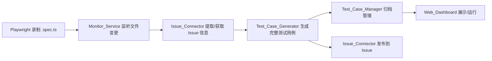
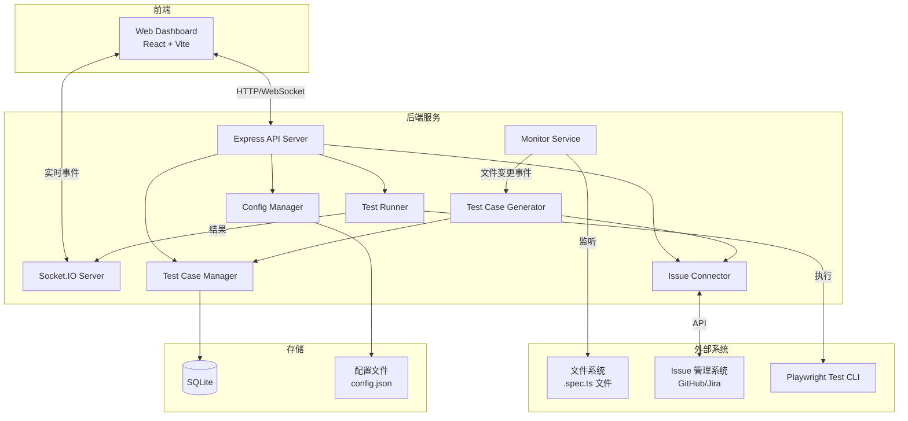
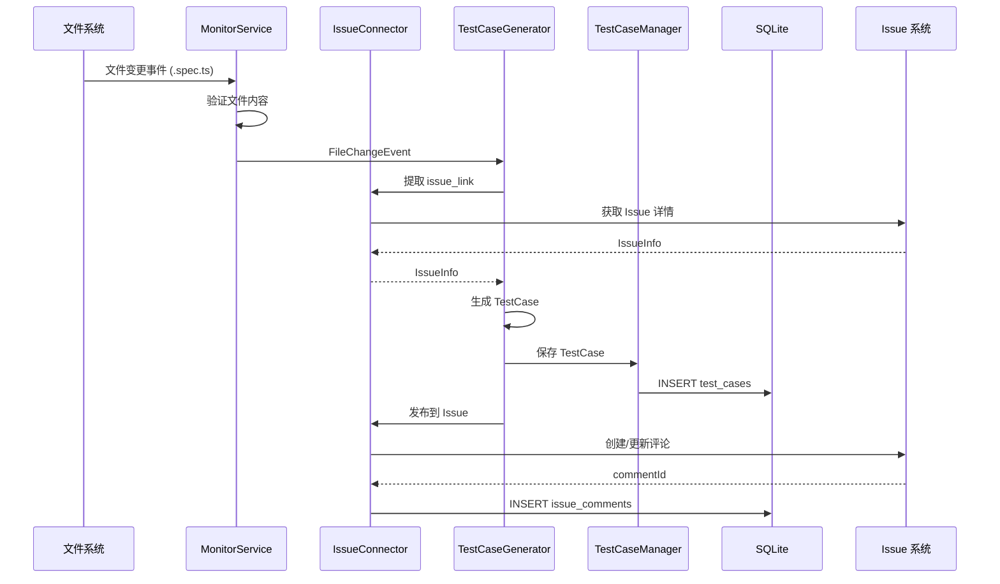

# 技术设计文档 - Test Monitor Tool

## 概述

Test Monitor Tool 是一个自动化测试工作监控工具后台，核心功能是衔接 VS Code Playwright 插件录制的测试脚本与项目 Issue 管理系统。系统采用 Node.js + TypeScript 技术栈，后端使用 Express 提供 REST API 和 WebSocket 实时通信，前端使用轻量级 Web 页面（React）提供管理面板。

### 核心工作流



### 技术选型

| 组件 | 技术方案 | 理由 |
|------|---------|------|
| 运行时 | Node.js + TypeScript | Playwright 原生支持，类型安全 |
| 文件监听 | chokidar | 成熟的跨平台文件监听库 |
| HTTP 服务 | Express | 轻量、生态丰富 |
| 实时通信 | Socket.IO | 测试进度实时推送 |
| 数据存储 | SQLite (better-sqlite3) | 轻量嵌入式，无需额外数据库服务 |
| 前端 | React + Vite | 快速开发，组件化 |
| Issue API | Octokit (GitHub) / Jira REST API | 官方 SDK |
| 测试执行 | Playwright Test CLI | 原生集成 |

## 架构

### 系统架构图



### 分层架构

系统采用三层架构：

1. **表现层**：Web Dashboard（React）+ REST API + WebSocket
2. **业务逻辑层**：Monitor Service、Issue Connector、Test Case Generator、Test Case Manager、Test Runner、Config Manager
3. **数据层**：SQLite 数据库 + 文件系统

### 项目目录结构

```
test-monitor-tool/
├── src/
│   ├── server/
│   │   ├── index.ts              # 服务入口
│   │   ├── api/
│   │   │   ├── routes.ts         # API 路由定义
│   │   │   ├── testCaseRoutes.ts
│   │   │   ├── testRunRoutes.ts
│   │   │   └── configRoutes.ts
│   │   ├── services/
│   │   │   ├── MonitorService.ts
│   │   │   ├── IssueConnector.ts
│   │   │   ├── TestCaseGenerator.ts
│   │   │   ├── TestCaseManager.ts
│   │   │   ├── TestRunner.ts
│   │   │   └── ConfigManager.ts
│   │   ├── db/
│   │   │   ├── database.ts       # SQLite 连接与初始化
│   │   │   └── migrations.ts
│   │   └── types/
│   │       └── index.ts          # 共享类型定义
│   └── client/
│       ├── index.html
│       ├── App.tsx
│       ├── pages/
│       │   ├── Dashboard.tsx
│       │   ├── TestCaseDetail.tsx
│       │   ├── TestRunResults.tsx
│       │   └── Settings.tsx
│       └── components/
│           ├── DirectoryTree.tsx
│           ├── TestCaseList.tsx
│           ├── RunProgress.tsx
│           └── SearchBar.tsx
├── config.json                   # 默认配置文件
├── package.json
├── tsconfig.json
└── vite.config.ts
```


## 组件与接口

### 1. MonitorService（文件监听服务）

负责监听指定目录下 `.spec.ts` 文件的新增和修改事件。

```typescript
interface MonitorService {
  // 启动监听
  start(watchDir: string): void;
  // 停止监听
  stop(): void;
  // 注册文件变更回调
  onFileChange(callback: (event: FileChangeEvent) => void): void;
  // 获取运行状态
  isRunning(): boolean;
}

interface FileChangeEvent {
  type: 'add' | 'change';
  filePath: string;
  fileName: string;
  content: string;
  timestamp: Date;
}
```

**实现要点**：
- 使用 chokidar 监听 `**/*.spec.ts` 模式
- 文件变更后读取内容，验证非空且格式合法
- 通过 EventEmitter 模式分发事件
- 启动时验证目标目录存在性

### 2. IssueConnector（Issue 连接器）

负责与外部 Issue 管理系统通信，支持提取 Issue 信息和发布测试用例。

```typescript
interface IssueConnector {
  // 从文件内容/文件名提取 issue 链接
  extractIssueLink(fileName: string, content: string): string | null;
  // 获取 Issue 详情
  fetchIssueInfo(issueLink: string): Promise<IssueInfo>;
  // 发布测试用例到 Issue
  publishTestCase(issueLink: string, testCase: TestCase): Promise<PublishResult>;
  // 更新已有评论
  updateTestCaseComment(issueLink: string, commentId: string, testCase: TestCase): Promise<PublishResult>;
}

interface IssueInfo {
  title: string;
  description: string;
  labels: string[];
  url: string;
}

interface PublishResult {
  success: boolean;
  commentId?: string;
  error?: string;
}
```

**实现要点**：
- Issue 链接提取策略：优先从文件注释中匹配 `// @issue: <url>` 格式，其次从文件名中匹配 `#<number>` 模式
- 发布失败时重试 3 次，间隔 10 秒
- 同一 Issue 已有评论时更新而非新建
- 通过适配器模式支持 GitHub 和 Jira

### 3. TestCaseGenerator（测试用例生成器）

将录制脚本与 Issue 信息整合为完整测试用例。

```typescript
interface TestCaseGenerator {
  // 生成测试用例
  generate(specFile: FileChangeEvent, issueInfo: IssueInfo | null): TestCase;
}

interface TestCase {
  id: string;
  title: string;
  issueLink: string | null;
  preconditions: string;
  steps: TestStep[];
  expectedResults: string;
  automationScript: string;    // 原始 Playwright 代码
  status: 'complete' | 'pending_info' | 'pending_publish';
  missingFields: string[];
  createdAt: Date;
  updatedAt: Date;
}

interface TestStep {
  order: number;
  action: string;
  expected: string;
}
```

### 4. TestCaseManager（测试用例管理器）

管理测试用例的存储、分类和检索。

```typescript
interface TestCaseManager {
  // 保存测试用例
  save(testCase: TestCase): Promise<string>;
  // 获取测试用例列表（按目录结构）
  list(filter?: TestCaseFilter): Promise<TestCaseTree>;
  // 获取单个测试用例详情
  get(id: string): Promise<TestCase | null>;
  // 更新测试用例
  update(id: string, updates: Partial<TestCase>): Promise<void>;
  // 获取测试用例元数据
  getMetadata(id: string): Promise<TestCaseMetadata>;
}

interface TestCaseFilter {
  name?: string;
  issueLink?: string;
  status?: string;
  module?: string;
}

interface TestCaseTree {
  name: string;
  path: string;
  children: (TestCaseTree | TestCaseLeaf)[];
}

interface TestCaseLeaf {
  id: string;
  name: string;
  status: string;
  issueLink: string | null;
  lastRunAt: Date | null;
}

interface TestCaseMetadata {
  id: string;
  createdAt: Date;
  updatedAt: Date;
  issueLink: string | null;
  runStatus: 'passed' | 'failed' | 'skipped' | 'not_run';
  lastRunAt: Date | null;
}
```

### 5. TestRunner（测试运行器）

执行测试用例并收集结果。

```typescript
interface TestRunner {
  // 运行单个测试
  runSingle(testCaseId: string): Promise<TestRunResult>;
  // 按目录批量运行
  runByDirectory(dirPath: string): Promise<TestRunSummary>;
  // 运行全部
  runAll(): Promise<TestRunSummary>;
  // 获取当前运行状态
  getRunningStatus(): RunningStatus | null;
}

interface TestRunResult {
  testCaseId: string;
  status: 'passed' | 'failed' | 'skipped';
  duration: number;       // 毫秒
  errorMessage?: string;
  screenshot?: string;    // 失败截图路径
  logs: string;
}

interface TestRunSummary {
  totalCount: number;
  passedCount: number;
  failedCount: number;
  skippedCount: number;
  totalDuration: number;
  results: TestRunResult[];
}

interface RunningStatus {
  isRunning: boolean;
  currentTestCase: string;
  progress: number;       // 0-100
  total: number;
  completed: number;
}
```

**实现要点**：
- 通过 `child_process.spawn` 调用 `npx playwright test` 执行测试
- 使用 Playwright 的 JSON reporter 收集结果
- 通过 Socket.IO 实时推送执行进度
- 失败时收集截图和日志

### 6. ConfigManager（配置管理器）

```typescript
interface ConfigManager {
  // 加载配置
  load(): AppConfig;
  // 获取当前配置
  getConfig(): AppConfig;
  // 更新配置
  update(updates: Partial<AppConfig>): void;
  // 验证配置
  validate(config: Partial<AppConfig>): ValidationResult;
  // 监听配置变更
  onConfigChange(callback: (config: AppConfig) => void): void;
}

interface AppConfig {
  watchDir: string;
  issueProvider: 'github' | 'jira';
  issueApiUrl: string;
  issueApiToken: string;
  testCaseDir: string;
  serverPort: number;
  retryCount: number;
  retryInterval: number;
}

interface ValidationResult {
  valid: boolean;
  errors: string[];
}
```

### REST API 接口

| 方法 | 路径 | 描述 |
|------|------|------|
| GET | `/api/test-cases` | 获取测试用例列表（支持筛选） |
| GET | `/api/test-cases/:id` | 获取测试用例详情 |
| PUT | `/api/test-cases/:id` | 更新测试用例 |
| POST | `/api/test-run/single/:id` | 运行单个测试 |
| POST | `/api/test-run/directory` | 按目录批量运行 |
| POST | `/api/test-run/all` | 运行全部测试 |
| GET | `/api/test-run/status` | 获取当前运行状态 |
| GET | `/api/test-run/history` | 获取运行历史 |
| GET | `/api/config` | 获取系统配置 |
| PUT | `/api/config` | 更新系统配置 |
| GET | `/api/stats` | 获取统计数据 |

### WebSocket 事件

| 事件名 | 方向 | 描述 |
|--------|------|------|
| `test:progress` | Server → Client | 测试执行进度更新 |
| `test:complete` | Server → Client | 测试执行完成 |
| `file:change` | Server → Client | 文件变更通知 |
| `testcase:created` | Server → Client | 新测试用例生成通知 |


## 数据模型

### SQLite 数据库表结构

#### test_cases 表

```sql
CREATE TABLE test_cases (
  id TEXT PRIMARY KEY,
  title TEXT NOT NULL,
  issue_link TEXT,
  preconditions TEXT,
  steps TEXT NOT NULL,           -- JSON 序列化的 TestStep[]
  expected_results TEXT,
  automation_script TEXT NOT NULL,
  spec_file_path TEXT NOT NULL,
  module TEXT,                   -- 归属模块（来自 Issue 标签）
  status TEXT NOT NULL DEFAULT 'complete',  -- complete | pending_info | pending_publish
  missing_fields TEXT,           -- JSON 序列化的 string[]
  created_at TEXT NOT NULL,
  updated_at TEXT NOT NULL
);
```

#### test_runs 表

```sql
CREATE TABLE test_runs (
  id TEXT PRIMARY KEY,
  test_case_id TEXT NOT NULL,
  status TEXT NOT NULL,          -- passed | failed | skipped
  duration INTEGER NOT NULL,     -- 毫秒
  error_message TEXT,
  screenshot_path TEXT,
  logs TEXT,
  run_at TEXT NOT NULL,
  FOREIGN KEY (test_case_id) REFERENCES test_cases(id)
);
```

#### issue_comments 表

用于跟踪已发布到 Issue 的评论，支持更新而非重复创建。

```sql
CREATE TABLE issue_comments (
  id TEXT PRIMARY KEY,
  test_case_id TEXT NOT NULL,
  issue_link TEXT NOT NULL,
  comment_id TEXT NOT NULL,      -- Issue 系统中的评论 ID
  published_at TEXT NOT NULL,
  updated_at TEXT NOT NULL,
  FOREIGN KEY (test_case_id) REFERENCES test_cases(id)
);
```

### 配置文件格式 (config.json)

```json
{
  "watchDir": "./tests/recorded",
  "issueProvider": "github",
  "issueApiUrl": "https://api.github.com",
  "issueApiToken": "",
  "issueRepo": "owner/repo",
  "testCaseDir": "./tests/cases",
  "serverPort": 3000,
  "retryCount": 3,
  "retryInterval": 10000
}
```

### 数据流




## 正确性属性

*属性（Property）是指在系统所有有效执行中都应成立的特征或行为——本质上是对系统应做什么的形式化陈述。属性是人类可读规范与机器可验证正确性保证之间的桥梁。*

### Property 1: Issue 链接提取正确性

*对于任意*文件名和文件内容，`extractIssueLink` 返回非空链接当且仅当文件内容包含 `// @issue: <url>` 注释或文件名包含 `#<number>` 模式。当内容不包含任何可识别的 Issue 模式时，应返回 null。

**Validates: Requirements 2.1, 2.3**

### Property 2: 文件变更事件数据完整性

*对于任意*有效的 `.spec.ts` 文件路径和内容，当 MonitorService 检测到文件变更时，生成的 `FileChangeEvent` 应包含正确的 `fileName`（与实际文件名一致）、`filePath`（与实际路径一致）和 `content`（与实际文件内容一致）。

**Validates: Requirements 1.3**

### Property 3: 无效文件过滤

*对于任意*内容为空字符串或纯空白字符的文件，MonitorService 应跳过该文件且不触发测试用例生成流程。

**Validates: Requirements 1.6**

### Property 4: 不存在的监听目录错误处理

*对于任意*不存在的目录路径，启动 MonitorService 应产生错误，且错误信息中应包含该目录路径。

**Validates: Requirements 1.5**

### Property 5: 测试用例生成完整性

*对于任意*有效的 spec 文件内容和 Issue 信息，TestCaseGenerator 生成的 TestCase 应同时满足：(a) 包含非空的 title、steps 和 expectedResults 字段；(b) automationScript 字段包含原始 Playwright 录制代码；(c) issueLink 字段与输入的 Issue 链接一致。

**Validates: Requirements 3.1, 3.2**

### Property 6: 测试用例保存与检索往返

*对于任意*有效的 TestCase 对象，通过 TestCaseManager 保存后再通过 ID 检索，返回的 TestCase 应与原始对象在所有业务字段上等价。

**Validates: Requirements 3.3**

### Property 7: 缺失信息标记

*对于任意* spec 文件，当 Issue 信息为 null 时，TestCaseGenerator 生成的 TestCase 的 status 应为 `pending_info`，且 missingFields 数组应包含缺失的字段名称。

**Validates: Requirements 3.4**

### Property 8: Markdown 格式化输出

*对于任意* TestCase 对象，格式化为 Markdown 的输出字符串应包含测试标题、测试步骤和预期结果三个部分。

**Validates: Requirements 4.2**

### Property 9: Issue 评论更新幂等性

*对于任意*已发布过评论的 Issue，再次发布同一测试用例时，应更新已有评论而非创建新评论，即 Issue 上该测试用例对应的评论数量始终为 1。

**Validates: Requirements 4.5**

### Property 10: 测试用例目录自动归类

*对于任意*带有模块标签的 TestCase，保存后其在目录树中的位置应与其模块标签对应的路径一致。

**Validates: Requirements 5.1, 5.2**

### Property 11: 测试用例元数据完整性

*对于任意*已保存的 TestCase，其元数据应包含非空的 createdAt、updatedAt 字段，以及正确的 issueLink 和 runStatus 值。

**Validates: Requirements 5.3**

### Property 12: 测试用例列表树结构正确性

*对于任意*一组已保存的测试用例，通过 list API 返回的树结构应包含所有已保存的测试用例，且每个叶节点的元数据与实际存储一致。

**Validates: Requirements 5.4**

### Property 13: 测试结果计数不变量

*对于任意*一组测试运行结果，TestRunSummary 中的 `passedCount + failedCount + skippedCount` 应等于 `totalCount`，且 `totalCount` 应等于 `results` 数组的长度。

**Validates: Requirements 6.4**

### Property 14: 失败测试信息收集

*对于任意*状态为 `failed` 的 TestRunResult，其 `errorMessage` 字段应非空，且 `logs` 字段应非空。

**Validates: Requirements 6.6**

### Property 15: 搜索筛选正确性

*对于任意*一组测试用例和任意筛选条件（名称、Issue 链接、运行状态），返回的结果中每一项都应满足所有指定的筛选条件。

**Validates: Requirements 7.4**

### Property 16: 配置加载与验证

*对于任意*配置对象，ConfigManager 的 validate 方法应正确识别缺失或无效的字段；对于包含所有必填字段的有效配置，load 方法应返回与输入等价的 AppConfig 对象。

**Validates: Requirements 8.1, 8.3**


## 错误处理

### 错误分类与处理策略

| 错误类型 | 场景 | 处理策略 |
|---------|------|---------|
| 文件系统错误 | 监听目录不存在 | 记录错误日志，通知用户，服务不启动 |
| 文件内容错误 | spec_file 为空或格式不合法 | 跳过文件，记录警告日志 |
| Issue API 错误 | Issue 系统不可达 | 标记为"待关联"，记录错误日志 |
| 发布失败 | 评论发布到 Issue 失败 | 重试 3 次（间隔 10s），失败后标记"待发布" |
| 配置错误 | 配置文件缺失或格式错误 | 使用默认配置启动，记录警告日志 |
| 测试执行错误 | Playwright 执行失败 | 收集错误信息、截图和日志，标记为 failed |
| 信息缺失 | 生成测试用例时缺少 Issue 信息 | 生成部分用例，标记缺失字段为"待补充" |

### 日志规范

- 使用结构化日志（JSON 格式）
- 日志级别：ERROR（系统错误）、WARN（可恢复问题）、INFO（正常流程）、DEBUG（调试信息）
- 每条日志包含：时间戳、级别、组件名、消息、上下文数据

### 重试机制

Issue 发布的重试策略：
- 最大重试次数：3 次（可通过配置调整）
- 重试间隔：10 秒（可通过配置调整）
- 重试失败后：标记为 `pending_publish` 状态，等待手动重试或下次自动触发

## 测试策略

### 双重测试方法

本项目采用单元测试与属性测试相结合的策略，确保全面的测试覆盖。

#### 属性测试（Property-Based Testing）

- **测试库**：使用 [fast-check](https://github.com/dubzzz/fast-check) 作为 TypeScript 属性测试库
- **最低迭代次数**：每个属性测试至少运行 100 次
- **标签格式**：每个测试用 `// Feature: test-monitor-tool, Property {number}: {property_text}` 注释标注
- **每个正确性属性对应一个属性测试**

属性测试覆盖范围：
- Property 1: Issue 链接提取（生成随机文件名和内容，验证提取逻辑）
- Property 2: 文件变更事件数据完整性（生成随机文件路径和内容）
- Property 3: 无效文件过滤（生成空/空白内容）
- Property 4: 不存在目录错误处理（生成随机路径）
- Property 5: 测试用例生成完整性（生成随机 spec 内容和 Issue 信息）
- Property 6: 保存与检索往返（生成随机 TestCase 对象）
- Property 7: 缺失信息标记（生成缺少 Issue 信息的场景）
- Property 8: Markdown 格式化（生成随机 TestCase）
- Property 9: 评论更新幂等性（模拟重复发布）
- Property 10: 目录自动归类（生成带不同模块标签的 TestCase）
- Property 11: 元数据完整性（生成随机 TestCase 并验证元数据）
- Property 12: 列表树结构（生成多个 TestCase 并验证树）
- Property 13: 结果计数不变量（生成随机测试结果集）
- Property 14: 失败测试信息收集（生成 failed 状态结果）
- Property 15: 搜索筛选正确性（生成随机用例和筛选条件）
- Property 16: 配置加载与验证（生成随机配置对象）

#### 单元测试

单元测试聚焦于具体示例、边界情况和集成点：

- **MonitorService**：启动/停止生命周期、目录不存在时的错误处理
- **IssueConnector**：API 调用成功/失败场景、重试逻辑（3 次重试验证）、Issue 信息获取
- **TestCaseGenerator**：具体的 spec 文件生成示例
- **TestCaseManager**：目录自动创建（边界情况）、空列表查询
- **TestRunner**：三种运行模式的具体示例、Playwright CLI 调用验证
- **ConfigManager**：配置文件缺失时的默认值回退（边界情况）、热重载验证

#### 测试框架

- **测试运行器**：Vitest
- **属性测试**：fast-check
- **HTTP Mock**：msw (Mock Service Worker) 用于模拟 Issue API
- **文件系统 Mock**：memfs 或 Vitest 的 vi.mock 用于文件系统操作
