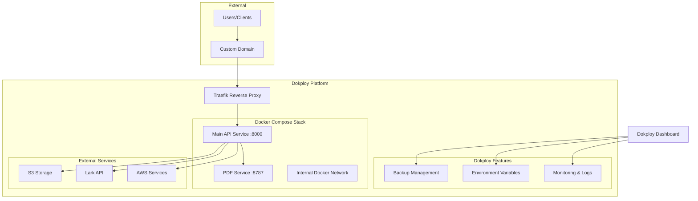

# Design Document

## Overview

This design document outlines the architecture and implementation approach for deploying the GMP Tool API system to Dokploy. The system consists of two main services: the Main API Service (port 8000) and the PDF Service (port 8787), both containerized using Docker and deployed through Dokploy's platform.

## Architecture

### Dokploy Deployment Architecture



### Dokploy Deployment Strategy

Based on Dokploy's features, we'll use **Docker Compose** deployment method:

1. **Docker Compose Stack**: Both services in one compose file
2. **Traefik Integration**: Automatic reverse proxy and SSL
3. **Dokploy Dashboard**: Web UI for management and monitoring
4. **Built-in Features**: Environment variables, logs, monitoring, backups

## Components and Interfaces

### Dokploy Docker Compose Configuration

**Purpose**: Single Docker Compose stack containing both services, managed through Dokploy's web interface.

**Services Structure**:
```yaml
services:
  main-api:
    # Main API service configuration
  pdf-service:
    # PDF service configuration
  
networks:
  gmp-network:
    # Internal communication network
```

### Main API Service

**Purpose**: Primary backend service handling query operations, batch processing, and async tasks.

**Dokploy Configuration**:
- **Source Provider**: GitHub/Git repository
- **Build Type**: Docker (using Dockerfile)
- **Port Mapping**: 8000 (internal) → 80/443 (external via Traefik)
- **Domain**: Custom domain through Dokploy
- **Health Check**: `/api/health` endpoint

**Environment Variables** (managed via Dokploy UI):
- `AWS_ACCESS_KEY_ID`
- `AWS_SECRET_ACCESS_KEY` 
- `AWS_REGION`
- `LARK_APP_ID`
- `LARK_APP_SECRET`
- `API_KEY`
- `PORT=8000`
- `PDF_SERVICE_URL=http://pdf-service:8787`

### PDF Service

**Purpose**: Dedicated service for HTML to PDF conversion using Puppeteer and Chrome.

**Dokploy Configuration**:
- **Build Type**: Docker (using Dockerfile with Chrome)
- **Port Mapping**: 8787 (internal only, no external access)
- **Health Check**: `/health` endpoint
- **Resource Limits**: Higher memory allocation for Chrome

**Environment Variables**:
- `PORT=8787`
- `CHROME_PATH=/usr/bin/google-chrome`

### Dokploy-Specific Features

**Traefik Integration**:
- Automatic reverse proxy configuration
- SSL certificate management
- Domain routing and load balancing

**Monitoring & Logs**:
- Real-time container logs via Dokploy UI
- CPU, memory, disk, and network monitoring
- Deployment history and rollback capabilities

**Environment Management**:
- Secure environment variable storage
- Environment-specific configurations
- Secret management through Dokploy interface

## Data Models

### Dokploy Docker Compose Configuration

```yaml
# docker-compose.yml for Dokploy
version: '3.8'

services:
  main-api:
    build: 
      context: ./backend
      dockerfile: Dockerfile
    ports:
      - "8000:8000"
    environment:
      - NODE_ENV=production
      - PORT=8000
      - PDF_SERVICE_URL=http://pdf-service:8787
    networks:
      - gmp-network
    healthcheck:
      test: ["CMD", "curl", "-f", "http://localhost:8000/api/health"]
      interval: 30s
      timeout: 10s
      retries: 3
    labels:
      - "traefik.enable=true"
      - "traefik.http.routers.main-api.rule=Host(`your-domain.com`)"
      - "traefik.http.services.main-api.loadbalancer.server.port=8000"

  pdf-service:
    build:
      context: ./backend/pdf-service
      dockerfile: Dockerfile
    ports:
      - "8787"  # Internal only
    environment:
      - PORT=8787
      - CHROME_PATH=/usr/bin/google-chrome
    networks:
      - gmp-network
    healthcheck:
      test: ["CMD", "curl", "-f", "http://localhost:8787/health"]
      interval: 30s
      timeout: 10s
      retries: 3

networks:
  gmp-network:
    driver: bridge
```

### Dokploy Application Configuration

```typescript
interface DokployAppConfig {
  name: string;
  sourceProvider: 'github' | 'git' | 'raw';
  buildType: 'docker' | 'nixpacks' | 'heroku' | 'paketo';
  dockerCompose: {
    path: string;
    services: string[];
  };
  domains: DomainConfig[];
  environment: EnvironmentVariable[];
  monitoring: MonitoringConfig;
}

interface DomainConfig {
  domain: string;
  ssl: boolean;
  redirects?: RedirectRule[];
}

interface EnvironmentVariable {
  key: string;
  value: string;
  secret: boolean;
}

interface MonitoringConfig {
  healthCheck: {
    enabled: boolean;
    path: string;
    interval: number;
  };
  resources: {
    memory: string;
    cpu: string;
  };
}
```

## Correctness Properties

*A property is a characteristic or behavior that should hold true across all valid executions of a system-essentially, a formal statement about what the system should do. Properties serve as the bridge between human-readable specifications and machine-verifiable correctness guarantees.*

### Property 1: Environment Variable Validation
*For any* container startup, if required environment variables are missing, the container should fail to start with a clear error message
**Validates: Requirements 1.4**

### Property 2: Port Configuration Consistency  
*For any* port configuration change, the service should start on the specified port and be accessible at that port
**Validates: Requirements 2.4**

### Property 3: API Request Routing
*For any* valid API request, the request should be routed to the correct service and return a valid response
**Validates: Requirements 3.1**

### Property 4: Service Availability Maintenance
*For any* service under normal load, the service should maintain availability and respond within acceptable time limits
**Validates: Requirements 3.4**

### Property 5: Health Check Response Consistency
*For any* health check request, the endpoint should return consistent health information including service status and dependencies
**Validates: Requirements 4.2**

### Property 6: Error Logging Completeness
*For any* error that occurs in the system, the error should be logged with sufficient detail for debugging and troubleshooting
**Validates: Requirements 4.3**

### Property 7: Error Message Clarity
*For any* service failure, the system should provide clear, actionable error messages to help identify and resolve issues
**Validates: Requirements 4.4**

## Error Handling

### Container Startup Errors
- Missing environment variables: Fail fast with descriptive error
- Port conflicts: Detect and report port availability issues
- Dependency failures: Validate external service connectivity

### Runtime Errors
- Service communication failures: Implement retry logic with exponential backoff
- Resource exhaustion: Graceful degradation and error reporting
- External service outages: Circuit breaker pattern implementation

### Deployment Errors
- Image build failures: Clear build error reporting
- Configuration errors: Validation before deployment
- Network issues: Connectivity testing and troubleshooting guides

## Testing Strategy

### Unit Tests
- Container configuration validation
- Environment variable parsing
- Health check endpoint functionality
- Error handling scenarios

### Integration Tests
- Inter-service communication
- External service integration
- End-to-end API workflows
- Deployment process validation

### Property-Based Tests
Each correctness property will be implemented as a property-based test with minimum 100 iterations:

- **Property 1**: Test container startup with various missing environment variable combinations
- **Property 2**: Test port configuration with different port values and verify accessibility
- **Property 3**: Test API routing with various request types and verify correct service handling
- **Property 4**: Test service availability under different load conditions
- **Property 5**: Test health check consistency across multiple requests
- **Property 6**: Test error logging with various error scenarios
- **Property 7**: Test error message quality across different failure modes

All property tests will be tagged with: **Feature: dokploy-api-deployment, Property {number}: {property_text}**

### Deployment Tests
- Docker image build verification
- Dokploy deployment configuration validation
- Service discovery and networking tests
- Rolling update functionality