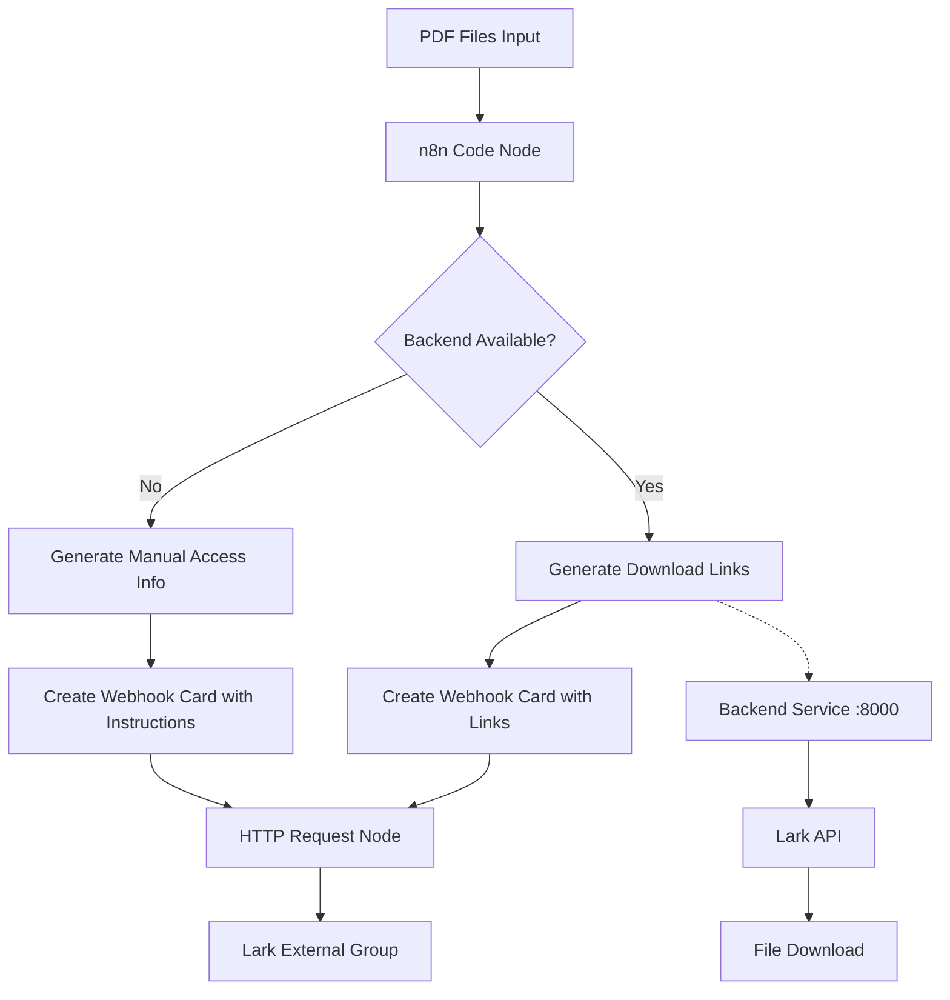
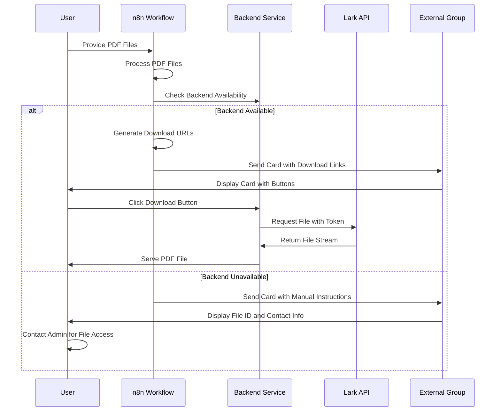

# Design Document

## Overview

This design document outlines the architecture and implementation approach for an n8n workflow system that sends PDF files to external Lark groups. The system addresses the unique challenge that external Lark groups cannot receive files directly through webhooks, requiring alternative file access methods.

The solution provides two operational modes:
1. **Backend-Integrated Mode**: Uses existing backend service to provide direct download links
2. **Manual Access Mode**: Provides file IDs and contact instructions for manual file retrieval

## Architecture

### High-Level Architecture



### Component Interaction Flow



## Components and Interfaces

### 1. PDF File Processor Component

**Purpose**: Handles PDF file detection, validation, and metadata extraction.

**Interface**:
```javascript
interface PDFProcessor {
  processFiles(inputItems: InputItem[]): ProcessedFile[]
  validatePDF(binaryData: BinaryData): boolean
  extractMetadata(file: ProcessedFile): FileMetadata
}

interface ProcessedFile {
  fileName: string
  binaryKey: string
  binary: BinaryData
  fileSize: number
  processedAt: string
}
```

**Implementation Details**:
- Scans all input items for PDF files using MIME type and file extension detection
- Validates file integrity and format
- Extracts file metadata including size and timestamps
- Preserves original binary data structure for downstream processing

### 2. Backend Integration Component

**Purpose**: Manages integration with the existing backend service for file downloads.

**Interface**:
```javascript
interface BackendIntegrator {
  checkBackendAvailability(): boolean
  generateDownloadURL(fileKey: string): string
  generateFileInfoURL(fileKey: string): string
  getBackendBaseURL(): string
}
```

**Implementation Details**:
- Detects backend service availability (port 8000)
- Generates standardized download URLs using pattern: `http://localhost:8000/download/{fileKey}`
- Provides fallback mechanisms when backend is unavailable
- Supports configuration for different backend endpoints

### 3. Webhook Card Generator Component

**Purpose**: Creates Lark-compatible interactive cards for external groups.

**Interface**:
```javascript
interface CardGenerator {
  generateCard(files: ProcessedFile[], accessMethod: AccessMethod): LarkCard
  createDownloadCard(files: ProcessedFile[], downloadURLs: string[]): LarkCard
  createManualAccessCard(files: ProcessedFile[], fileKeys: string[]): LarkCard
}

interface LarkCard {
  config: CardConfig
  header: CardHeader
  elements: CardElement[]
}
```

**Implementation Details**:
- Generates two types of cards based on backend availability
- **Download Card**: Includes direct download buttons and links
- **Manual Access Card**: Shows file IDs and contact instructions
- Uses Lark's interactive card format with proper styling and icons
- Supports multiple files with clear file listing

### 4. Webhook Delivery Component

**Purpose**: Handles reliable message delivery to Lark external groups.

**Interface**:
```javascript
interface WebhookDelivery {
  sendWebhook(webhookURL: string, card: LarkCard): WebhookResponse
  formatWebhookRequest(card: LarkCard): HTTPRequest
  handleDeliveryErrors(error: Error): ErrorResponse
}

interface HTTPRequest {
  url: string
  method: 'POST'
  headers: Record<string, string>
  body: WebhookPayload
}
```

**Implementation Details**:
- Formats webhook requests according to Lark API specifications
- Sets proper HTTP headers including `Content-Type: application/json; charset=utf-8`
- Implements error handling and retry logic
- Provides detailed error reporting for troubleshooting

## Data Models

### File Processing Models

```javascript
// Input file structure from n8n
interface InputItem {
  json: Record<string, any>
  binary: Record<string, BinaryData>
}

interface BinaryData {
  data: string          // Base64 encoded file data
  fileName: string      // Original file name
  mimeType: string      // MIME type (application/pdf)
  fileExtension: string // File extension
}

// Processed file information
interface ProcessedFile {
  fileName: string      // Sanitized file name
  binaryKey: string     // Key in binary object
  binary: BinaryData    // Original binary data
  fileSize: number      // File size in bytes
  fileType: 'pdf'       // File type identifier
  processedAt: string   // ISO timestamp
}
```

### Webhook Models

```javascript
// Lark webhook card structure
interface LarkCard {
  config: {
    wide_screen_mode: boolean
    enable_forward: boolean
  }
  header: {
    template: string
    title: {
      tag: 'plain_text'
      content: string
    }
  }
  elements: CardElement[]
}

interface CardElement {
  tag: 'div' | 'hr' | 'action'
  text?: {
    tag: 'lark_md' | 'plain_text'
    content: string
  }
  actions?: ButtonAction[]
}

interface ButtonAction {
  tag: 'button'
  text: {
    tag: 'plain_text'
    content: string
  }
  type: 'primary' | 'default'
  url?: string              // For download buttons
  value?: Record<string, any> // For callback buttons
}
```

### Configuration Models

```javascript
interface WorkflowConfig {
  webhookURL: string        // Lark webhook URL
  backendBaseURL: string    // Backend service URL
  enableBackendIntegration: boolean
  cardTemplate: CardTemplate
  errorHandling: ErrorConfig
}

interface CardTemplate {
  title: string
  downloadButtonText: string
  manualAccessText: string
  contactInstructions: string
}
```

## Error Handling

### Error Categories and Responses

1. **File Processing Errors**
   - Invalid PDF format: Skip file, log warning, continue processing
   - Missing binary data: Throw error with diagnostic information
   - File size too large: Log warning, attempt processing

2. **Backend Integration Errors**
   - Backend unavailable: Switch to manual access mode
   - Invalid backend response: Fall back to file ID display
   - Network timeout: Retry once, then fall back

3. **Webhook Delivery Errors**
   - Invalid webhook URL: Throw configuration error
   - Network failure: Retry with exponential backoff
   - Lark API error: Log error details, provide troubleshooting info

4. **Configuration Errors**
   - Missing required parameters: Throw validation error with specific missing fields
   - Invalid URL format: Provide format examples and validation

### Error Recovery Strategies

```javascript
interface ErrorHandler {
  handleFileProcessingError(error: Error, file: InputItem): void
  handleBackendError(error: Error): AccessMethod
  handleWebhookError(error: Error): RetryStrategy
  logError(error: Error, context: ErrorContext): void
}

enum AccessMethod {
  BACKEND_DOWNLOAD = 'backend_download',
  MANUAL_ACCESS = 'manual_access'
}
```

## Testing Strategy

### Unit Testing Approach

**File Processing Tests**:
- Test PDF detection with various MIME types and file extensions
- Validate binary data preservation through processing pipeline
- Test metadata extraction accuracy
- Verify error handling for invalid files

**Backend Integration Tests**:
- Mock backend availability checks
- Test URL generation with different file keys
- Validate fallback behavior when backend is unavailable
- Test configuration flexibility

**Card Generation Tests**:
- Verify card structure compliance with Lark API specifications
- Test both download and manual access card variants
- Validate proper escaping and formatting of file names
- Test multiple file scenarios

**Webhook Delivery Tests**:
- Mock HTTP requests to test request formatting
- Validate error handling and retry logic
- Test different response scenarios from Lark API

## Correctness Properties

*A property is a characteristic or behavior that should hold true across all valid executions of a system-essentially, a formal statement about what the system should do. Properties serve as the bridge between human-readable specifications and machine-verifiable correctness guarantees.*

### Property 1: PDF File Processing Completeness
*For any* collection of input items containing PDF files, the workflow should successfully process all valid PDF files and preserve their complete binary data and metadata in the output.
**Validates: Requirements 1.1, 1.2, 1.3, 1.4**

### Property 2: Error Resilience During File Processing  
*For any* collection of input items containing both valid and invalid files, the workflow should process all valid PDF files successfully while skipping invalid files without stopping execution.
**Validates: Requirements 1.5, 6.1, 6.4**

### Property 3: Webhook Card Structure Compliance
*For any* collection of processed PDF files, the generated webhook card should always contain required elements: file information, count, timestamp, access instructions, and proper Lark card formatting.
**Validates: Requirements 2.1, 2.2, 2.3, 2.4, 2.5**

### Property 4: Backend Integration URL Generation
*For any* valid file key, when backend service is available, the generated download URL should follow the exact pattern `http://localhost:8000/download/{fileKey}` and the card should include clickable download buttons.
**Validates: Requirements 3.1, 3.2, 5.1, 5.2**

### Property 5: Fallback Mode Activation
*For any* workflow execution where backend service is unavailable or disabled, the system should automatically switch to manual access mode and generate cards with file IDs and contact instructions.
**Validates: Requirements 3.3, 5.5, 6.3, 7.5**

### Property 6: Webhook Request Formatting
*For any* valid webhook card, the generated HTTP request should have proper JSON structure, correct Content-Type headers, and valid Lark webhook URL formatting.
**Validates: Requirements 4.1, 4.2**

### Property 7: Error Logging and Recovery
*For any* component failure during workflow execution, the system should log sufficient diagnostic information and continue processing remaining tasks where possible.
**Validates: Requirements 4.4, 6.2, 6.5**

### Property 8: Configuration Flexibility
*For any* valid configuration parameters (webhook URLs, backend URLs, card templates), the workflow should properly apply the configuration and generate appropriate outputs matching the specified settings.
**Validates: Requirements 7.1, 7.2, 7.3, 7.4**

### Property 9: Data Preservation Through Pipeline
*For any* valid input containing PDF files, the binary data should remain intact and accessible throughout the entire processing pipeline, from input to final webhook delivery.
**Validates: Requirements 1.4, 4.5**

### Property 10: File Access Method Consistency
*For any* processed file collection, the chosen access method (backend download or manual access) should be consistently applied to all files in the same workflow execution.
**Validates: Requirements 3.1, 3.3**

### Property-Based Testing

Property tests will be implemented using a suitable property-based testing framework to validate these universal behaviors across randomly generated inputs, configurations, and system states. Each property test will run a minimum of 100 iterations to ensure comprehensive coverage of the input space.