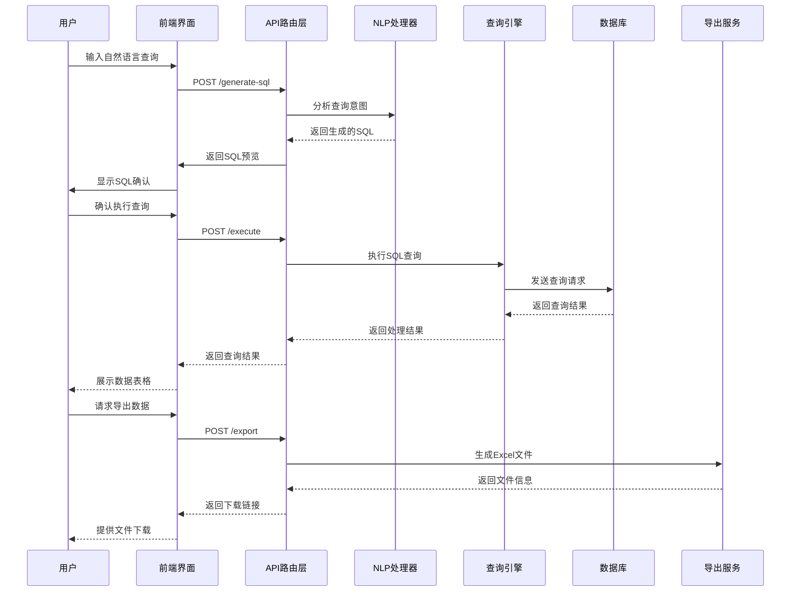
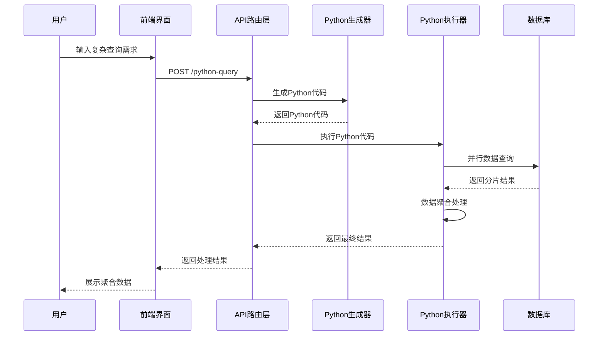
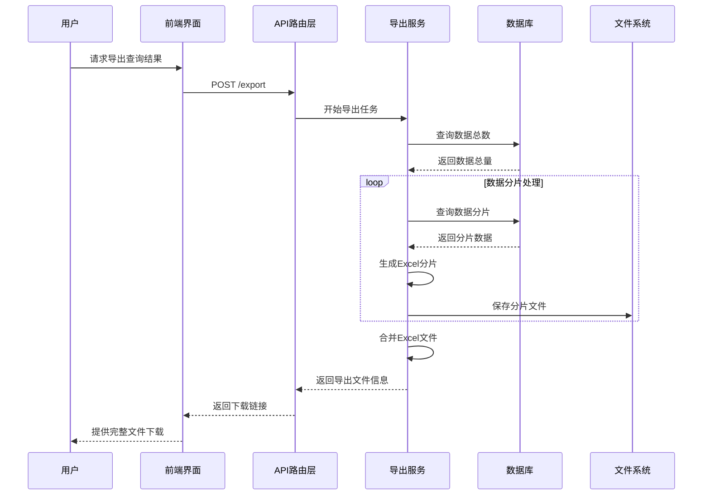

# 智能查询系统模块协作时序图

## 核心模块划分

### 1. 前端层 (Frontend)
- **职责**：用户界面展示、用户输入处理、结果渲染
- **组件**：查询页面、结果展示、导出控制

### 2. API路由层 (API Router)
- **职责**：请求路由、参数验证、响应格式化
- **接口**：/generate-sql, /execute, /python-query, /export

### 3. 自然语言处理模块 (NLP Processor)
- **职责**：意图识别、参数提取、SQL生成
- **文件**：sqlGenerator.js

### 4. 查询执行引擎 (Query Engine)
- **职责**：SQL执行、状态管理、结果获取
- **文件**：athenaService.js

### 5. Python执行器 (Python Executor)
- **职责**：Python代码生成、大数据处理
- **文件**：pythonCodeGenerator.js, pythonExecutor.js

### 6. 导出服务 (Export Service)
- **职责**：数据分包、Excel生成、文件管理
- **文件**：exportService.js

### 7. 数据库层 (Database)
- **职责**：数据存储、查询执行
- **技术**：AWS Athena + 多种数据库连接

## 标准SQL查询时序图



## Python查询时序图



## 导出服务时序图



## 模块实现细节

### 1. 自然语言处理模块实现
```javascript
// sqlGenerator.js 核心方法
class SQLGenerator {
  // 意图分析：关键词匹配 + 置信度计算
  analyzeIntent(queryText) {
    // 检查预定义模板关键词
    // 计算匹配置信度
    // 返回最佳匹配模板
  }
  
  // 参数提取：正则表达式匹配
  extractParameters(queryText) {
    // 提取时间范围、数量限制等
    // 设置默认参数值
  }
  
  // SQL生成：模板填充
  buildSQL(intent, parameters) {
    // 将参数填充到模板中
    // 优化SQL语句结构
  }
}
```

### 2. 查询执行引擎实现
```javascript
// athenaService.js 核心方法
class AthenaService {
  // 异步查询执行
  async executeQuery(sql, database) {
    // 启动查询执行
    // 轮询等待完成
    // 获取并解析结果
  }
  
  // 状态管理
  async waitForQueryCompletion(queryId) {
    // 定期检查查询状态
    // 处理超时和错误
  }
}
```

### 3. 模块间通信协议

**请求格式**：
```json
{
  "queryText": "显示2023年销售额前10的产品",
  "database": "sales_db",
  "limit": 1000,
  "optimize": true
}
```

**响应格式**：
```json
{
  "success": true,
  "data": [...],
  "metadata": {
    "rowCount": 100,
    "executionTime": "1.2s",
    "cost": "$0.0005"
  }
}
```

## 技术架构优势

1. **分层架构**：清晰的职责分离，便于维护和测试
2. **异步处理**：支持长时间运行的查询和导出任务
3. **弹性扩展**：模块化设计支持功能逐步添加
4. **错误隔离**：单个模块故障不影响整体系统运行
5. **标准化接口**：统一的请求响应格式，便于集成

这个时序图展示了系统各模块如何协作完成从用户输入到结果返回的完整流程，体现了系统的模块化设计和清晰的职责划分。